<h1 align="center">👾 Tic Tac Toe using Firebase Realtime Database</h1></br>
<p align="center">  
A Tic Tac Toe game Android app for playing in real time with two devices. Using Firebase, Compose and Hilt based on modern Android tech-stack and MVVM architecture.
</p>
</br>

<p align="center">
  <a href="https://opensource.org/licenses/MIT"></a>
  <a href="https://android-arsenal.com/api?level=24"></a>
  <a href="https://github.com/waleska404"></a> 
  <a href="https://github.com/waleska404/algorithms-visualizer"></a> 
</p>

<h3 align="center">🚧 IN PROGRESS 🚧</h2>

## Screenshots


## Tech stack
- 100% [Kotlin](https://kotlinlang.org/) based + [Coroutines](https://github.com/Kotlin/kotlinx.coroutines) + [Flow](https://kotlin.github.io/kotlinx.coroutines/kotlinx-coroutines-core/kotlinx.coroutines.flow/) for asynchronous.
- Hilt for dependency injection.
- Firebase: Realtime database.
- JetPack
  - Compose - A modern toolkit for building native Android UI.
  - Lifecycle - dispose observing data when lifecycle state changes.
  - ViewModel - UI related data holder, lifecycle aware.
- Architecture
  - Clean Architecture.
  - MVVM Architecture (Declarative View - ViewModel - Model)
- Material Design & Animations.

## Features
- Create game and copy the game ID to share it.
- Join a game with the game ID.
- Play the game.

## Future Features (Contributions are welcome!)
- Game history.
  
## How to - Build guide
For security reasons, I have not added the `google-services.json` file. This file is responsible for establishing the connection to the Firebase database. Here, I will explain how you can set up own Firebase Realtime database for FREE, download `google-services.json` and how to use it. This is necessary if you want to download and build this Android project.

1. Login to [firebase console](https://console.firebase.google.com/) and add a new project.
   
   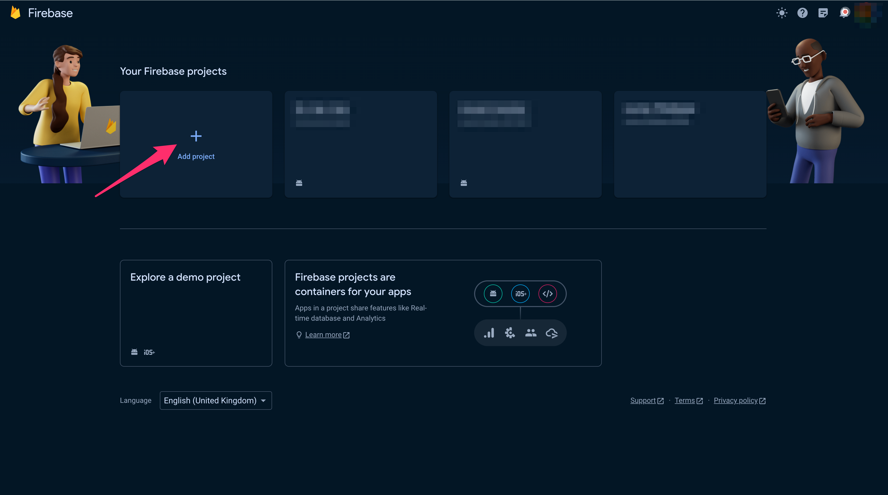

2. Give a name to the Firebase project.

   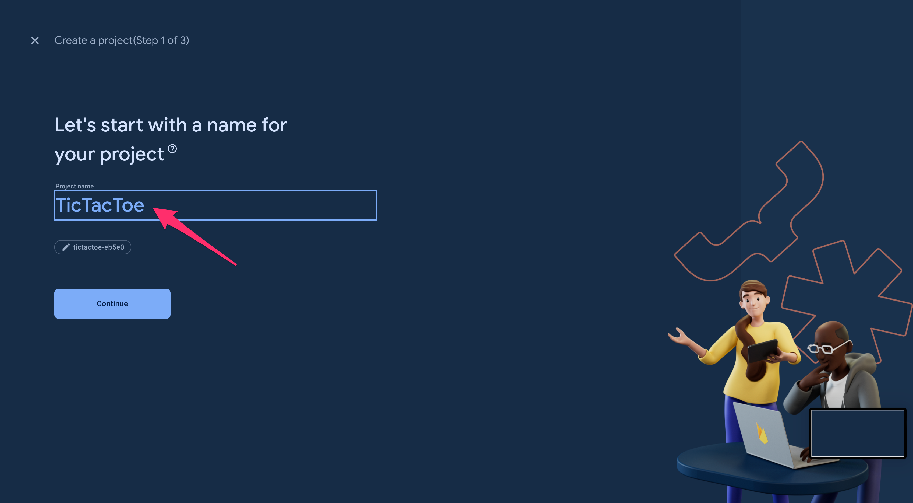

3. If you want you can enable Google Analytics. Click `Continue`.

   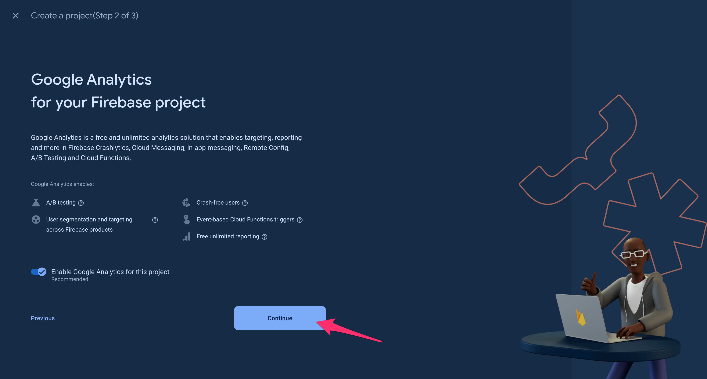

4. If you enabled Google Analytics select your preferred Google Analytics account and click `Create project`.

   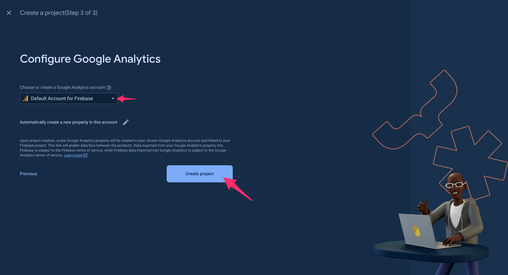

5. Wait until your project is ready and click `Continue`.

   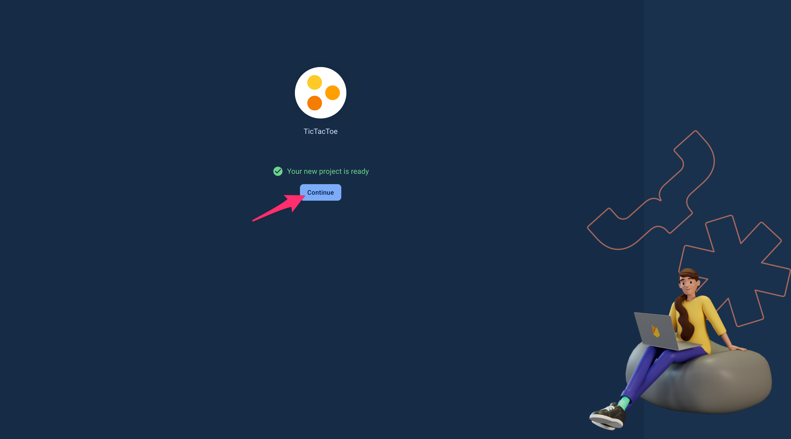

6. On your new Firebase project main screen click the Android icon to add Firebase to your Android app.

   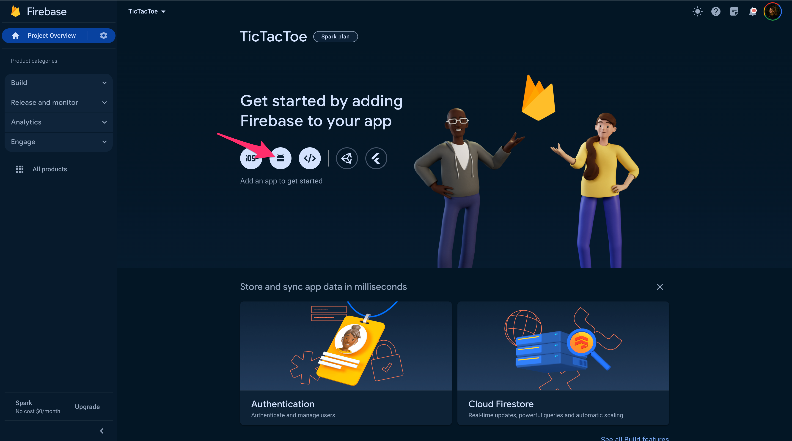

7. Register the app:
     - ⚠️ Make sure to specify `com.waleska404.tictactoe` as the package name. ⚠️
     - Optionally enter the nickname for the app.
     - Click `Register app`.
   
   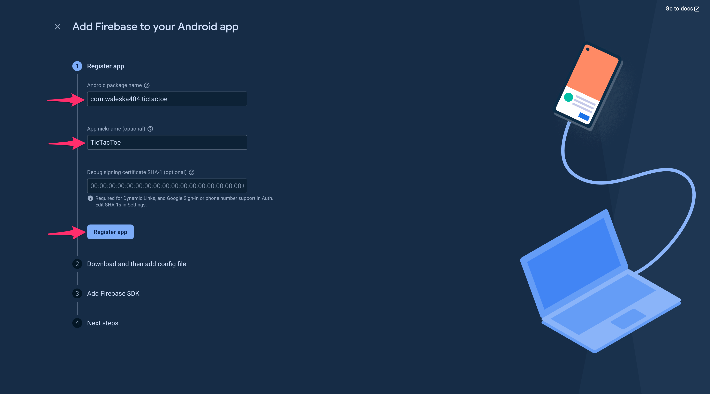

8. ⚠️ DO NOT DOWNLOAD THE JSON FILE YET. ⚠️ Just click continue, it will be downloaded later when all the config is set up.

   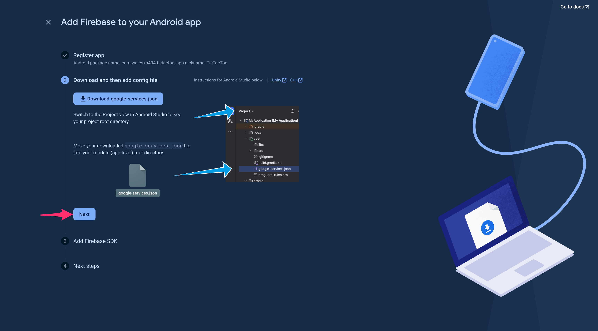

9. The Firebase SDK is already added in this project. You can check if everything is fine just in case. Click `Next`.

    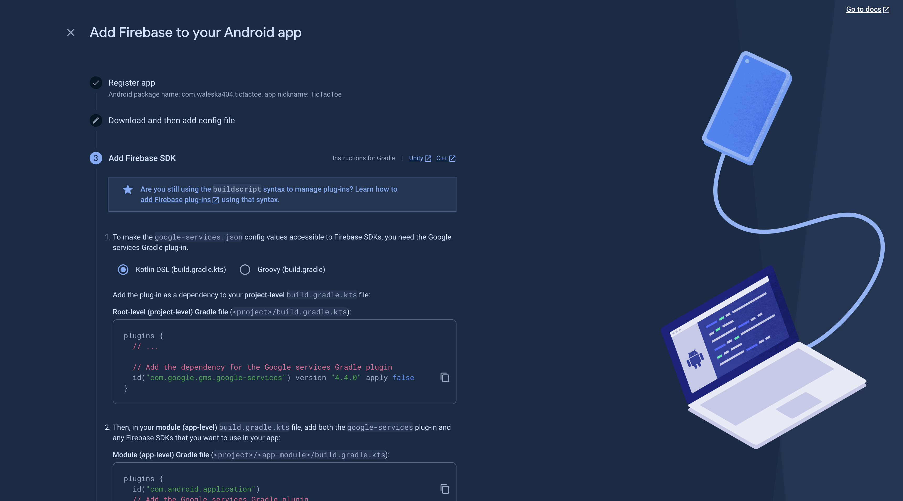
    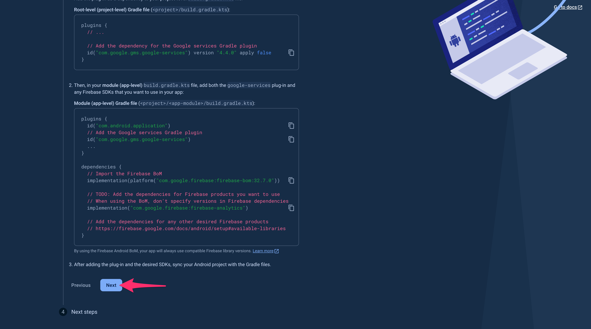

10. Click `Continue to the console`.
    
    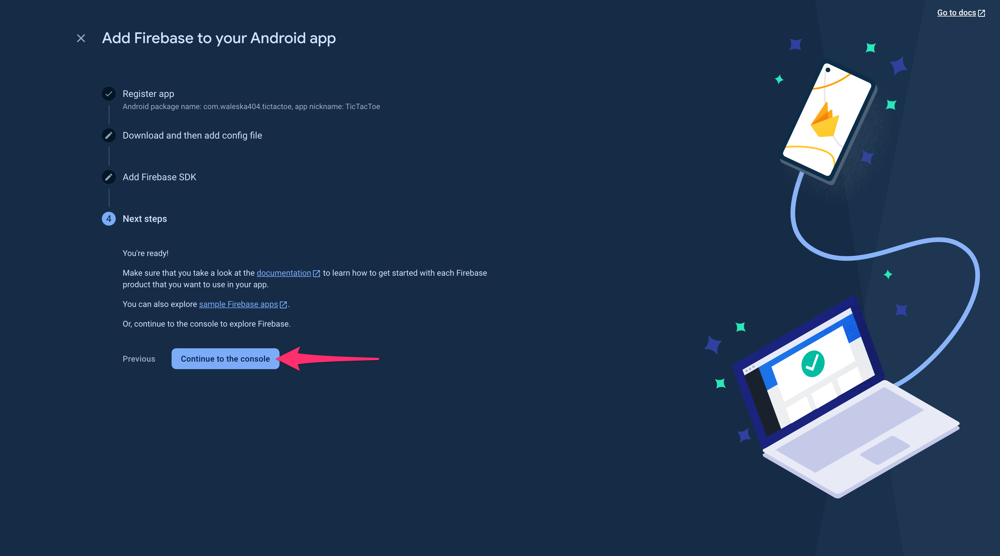

11. On the main page of the Firebase project go to `Build > Realtime Database`.

    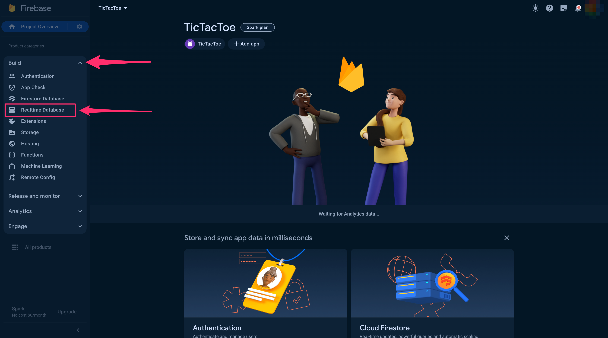

12. On Realtime Database page click `Create Database`.

    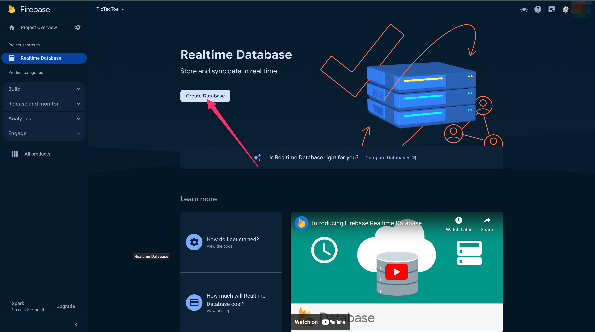

13. Choose your prefrerred location for the database and click `Next`.

    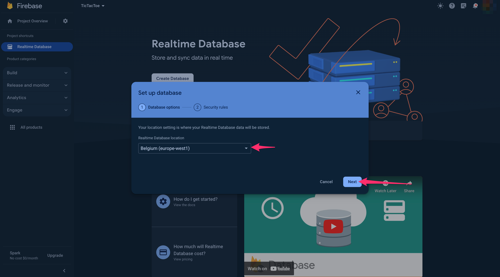

14. Choose any option for the security rules and click `Enable`, we will edit this rules later.

    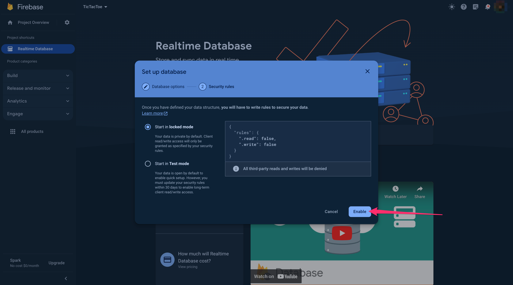

15. Go to Rules tab and edit them specifying the following rules: Then click on `Publish`.
    ```
    {
      "rules": {
        ".read": true,
        ".write": true
      }
    }
    ```
    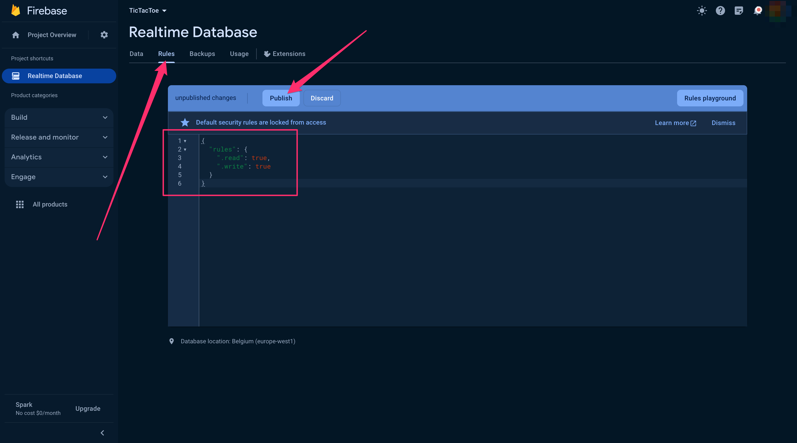

16. Finally, go to `Project settings` and download the `google-services.json` file.

    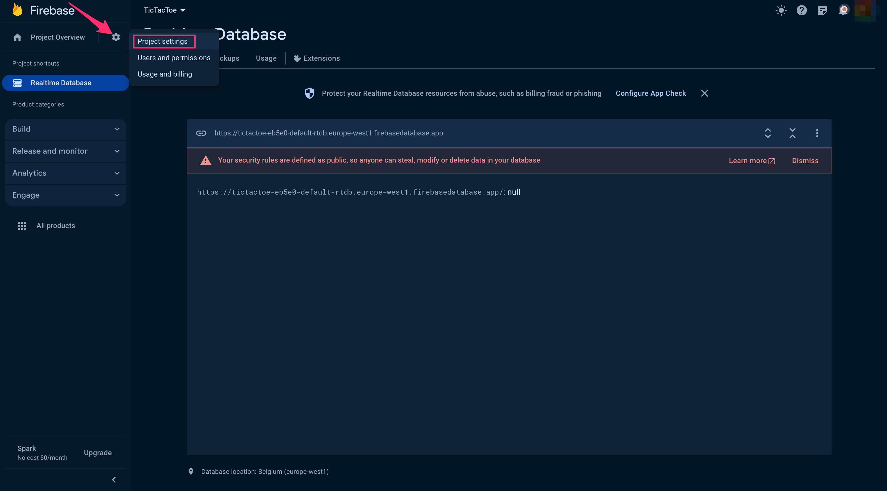
    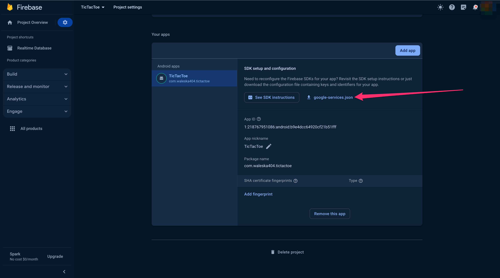

17. Last step: Add the downloaded file to your Android project under `TicTacToe > app > src` and build the project.

    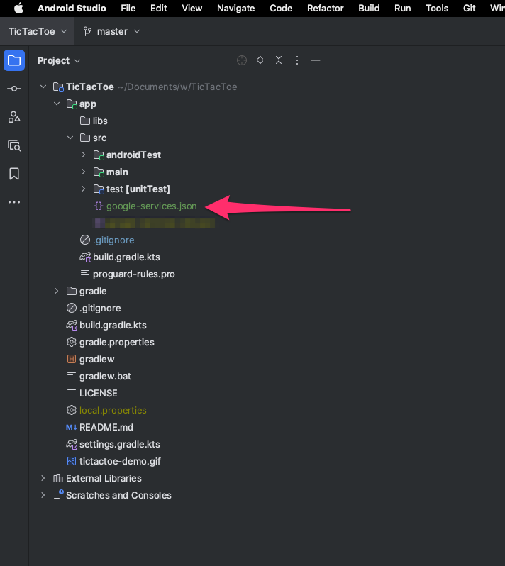

    
   

## Find this repository useful? :heart:
Support it by joining __[stargazers](https://github.com/waleska404/tic-tac-toe/stargazers)__ for this repository. :star: <br>
And __[follow](https://github.com/waleska404)__ me for my next creations! 🤓

# License
```xml
MIT License

Copyright (c) 2023 Paula Boyano Ivars

Permission is hereby granted, free of charge, to any person obtaining a copy
of this software and associated documentation files (the "Software"), to deal
in the Software without restriction, including without limitation the rights
to use, copy, modify, merge, publish, distribute, sublicense, and/or sell
copies of the Software, and to permit persons to whom the Software is
furnished to do so, subject to the following conditions:

The above copyright notice and this permission notice shall be included in all
copies or substantial portions of the Software.

THE SOFTWARE IS PROVIDED "AS IS", WITHOUT WARRANTY OF ANY KIND, EXPRESS OR
IMPLIED, INCLUDING BUT NOT LIMITED TO THE WARRANTIES OF MERCHANTABILITY,
FITNESS FOR A PARTICULAR PURPOSE AND NONINFRINGEMENT. IN NO EVENT SHALL THE
AUTHORS OR COPYRIGHT HOLDERS BE LIABLE FOR ANY CLAIM, DAMAGES OR OTHER
LIABILITY, WHETHER IN AN ACTION OF CONTRACT, TORT OR OTHERWISE, ARISING FROM,
OUT OF OR IN CONNECTION WITH THE SOFTWARE OR THE USE OR OTHER DEALINGS IN THE
SOFTWARE.
```
